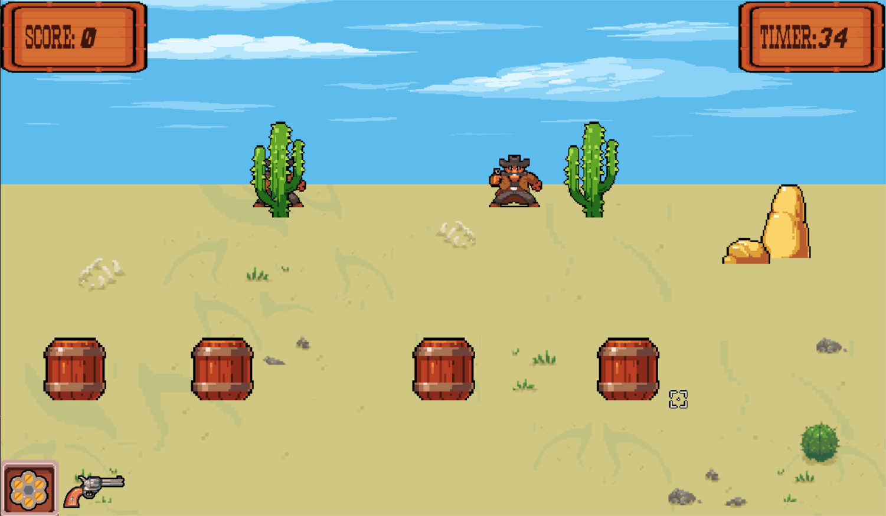

# Gunstrike Reload

¡Bienvenido a Gunstrike Reload, un emocionante juego de on-rail shooter de vaqueros creado en Pygame!

## Descripción del juego
Gunstrike Reload te sumerge en el Salvaje Oeste, donde tu misión es derribar a tantos cowboys como sea posible antes de que se agote el tiempo. ¿Tienes lo necesario para ser el vaquero más rápido del oeste?

## Características principales
- **Shooter y Coverturas:** Tienes la destreza para acabar con todos los enemigos antes de que termine el tiempo. 

## Instalación
1. Clona el repositorio: `git clone https://github.com/tu-usuario/gunstrike-reload.git`
2. Instala las dependencias: `pip install -r requirements.txt`
3. Ejecuta el juego: `python main.py`

## Requisitos del sistema
Asegúrate de cumplir con los siguientes requisitos del sistema:
- Python 3.10 
- Pygame (puedes instalarlo ejecutando `pip install pygame`)

## Contribuciones
¡Contribuciones son bienvenidas! Si encuentras algún problema o tienes alguna sugerencia, no dudes en abrir un problema o enviar un pull request.

## Licencia
Este proyecto está bajo la licencia [MIT](LICENSE).

¡Diviértete jugando Gunstrike Reload!
