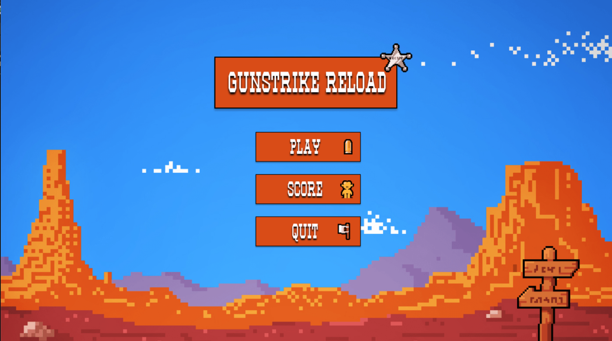
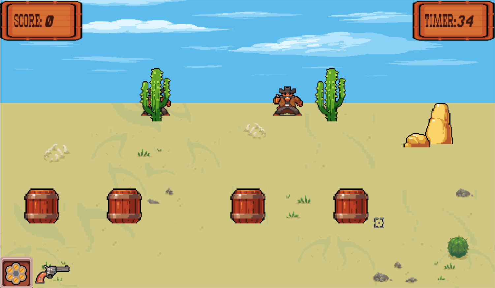

<h1 align='center'>Gunstrike Reload 🤠</h1>

_¡Bienvenido a Gunstrike Reload, un emocionante juego de aim-trainer de vaqueros creado en Pygame!_

Descripción del juego
---
Gunstrike Reload te sumerge en el Salvaje Oeste, donde tu misión es derribar a tantos cowboys como sea posible antes de que se agote el tiempo. ¿**Tienes lo necesario para ser el vaquero más rápido del oeste**?

## Características principales
- **Shooter y Coverturas:** Tienes la destreza para acabar con todos los enemigos antes de que termine el tiempo. 

## Instalación
1. Clona el repositorio: 
    - `git clone https://github.com/ivobarin/gunstrike-reload.git`
    - utilizando una shell key: `git clone git@github.com:ivobarin/Gunstrike-Reload-.git`
2. Ejecuta el juego: 
    - `main.exe`
    - `main.py` en la ruta `www\scripts`     
   
## Requisitos del sistema
Si deseas ejecutar el source code `main.py`: 
- Instala el paquete de pygame: `pip install pygame`
- Tener una version de Python mayor o igual a la `3.10`   

## Licencia
Este proyecto está bajo la licencia _MIT_

    ¡Diviértete jugando Gunstrike Reload!
